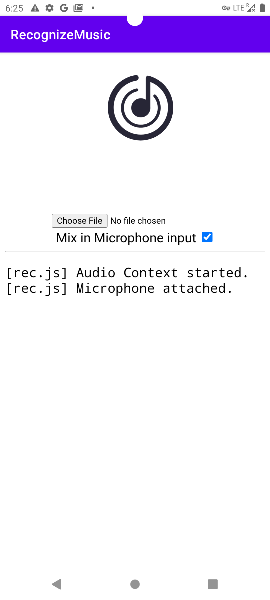
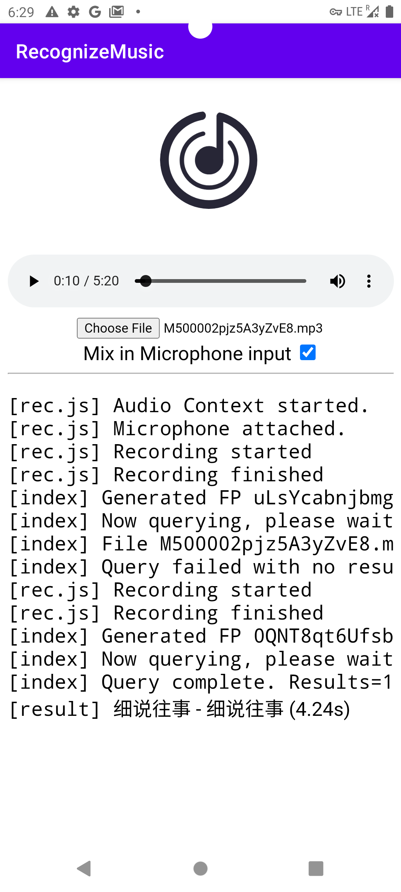

# 一个听歌识曲的demo

### 注意事项

因为html里调用的js方法用到了WEB AUDIO API的AudioWorkletProcessor，这个需要chrome66版本以上以及webview版本要新

如果使用android studio AVD请自行更新chrome版本以及webview版本，在google play商代中搜索然后update就行，没有就自行下载（登录谷歌需要VPN，需要的朋友可以联系我）

通过音频文件或者录音获取音纹audioFP,再通过使用 https://cors-anywhere.herokuapp.com/ 绕过cors限制对网易云官方pi发出请求（访问可用度受限）

### 网易云api

可以使用网易云api,由于作者已经不再更新维护，见[https://github.com/Binaryify/NeteaseCloudMusicApi]()

Gitee上可以下载旧版本

https://gitee.com/alamhubb/NeteaseCloudMusicApi

安装见安装文档

在assets文件夹下html文件中修改fetch请求

```javascript
fetch('https://cors-anywhere.herokuapp.com/' +
            'https://interface.music.163.com/api/music/audio/match?' +
                new URLSearchParams({
                    sessionId: '0123456789abcdef', algorithmCode: "shazam_v2", duration: duration, rawdata: FP, times: 1, decrypt: 1
                }), {
                    method: 'POST'
                }
```

修改为

```javascript
fetch(
            'http://localhost:3000/audio/match?' +
            new URLSearchParams(Object.assign({
                audioFP: FP,
                duration: duration
            }))
        )
```

### 使用效果



如图所示则是应用成功，否则请按上面所说检查配置

结果显示



如图所示，搜索成功！！

### 项目说明

webview作为在安卓开发中常见的开发工具，可以减少开发成本，本项目是一个学习安卓和html5跨平台开发的一个demo，已经应用到本人的音乐软件MusicPro中，使用javascript和安卓进行交互，实现了点击搜索结果在安卓软件应用中播放识别到的歌曲，感兴趣的话可以看一下我的另一个项目 [https://github.com/sunchi1d/MusicPro]()

### 鸣谢

https://github.com/Binaryify/NeteaseCloudMusicApi

https://github.com/mos9527/ncm-afp

https://github.com/Rob--W/cors-anywhere
